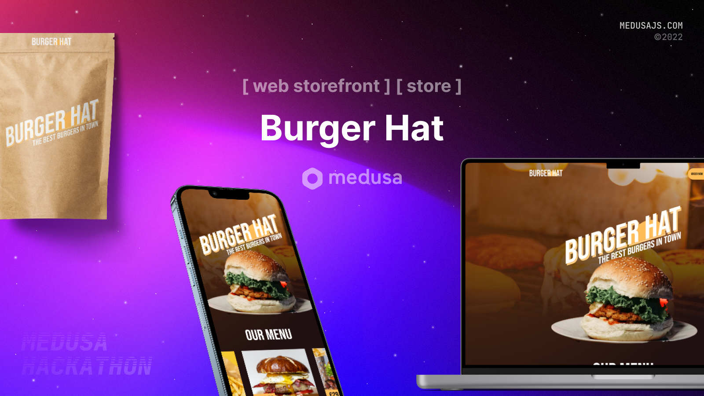

# Burger Hat



### Participants

Github : [@realanupreet](https://github.com/realanupreet)

Discord : realanupreet#5367

Twitter : [@real_anupreet](https://twitter.com/real_anupreet)

### Description

A burger restaurant storefront powered by NextJs, tailwindcss and MedusaJs

### Preview


## Set up Project Requirements

You need following requirement to setup your project:

### Prerequisites

- Medusa CLI (`npm install -g @medusajs/medusa-cli`) .
- Redis (https://redis.io/)
- PostgreSQL (https://www.postgresql.org/)
- Node (https://node.org/)

### Install Project

Here are the steps to be taken after that:

1. Clone the repository:
   ```bash
   git clone https://github.com/AniqJaved/bakeryshop.git
   ```
2. Change directory:
   ```bash
   cd bakeryshop
   ```
3. Install dependencies
   ```bash
   cd my-medusa-store
   yarn install
   ```
4. Start the server
   ```bash
   medusa develop
   ```
5. Change directory , install dependencies and start the store-front
   ```bash
   cd ..
   cd my-store-front
   yarn install
   yarn dev
   ```

## Resources

- [Medusa’s GitHub repository](https://github.com/medusajs/medusa)
- [How to Create Services](https://docs.medusajs.com/advanced/backend/services/create-service)
- [NextJs](https://nextjs.org/)
